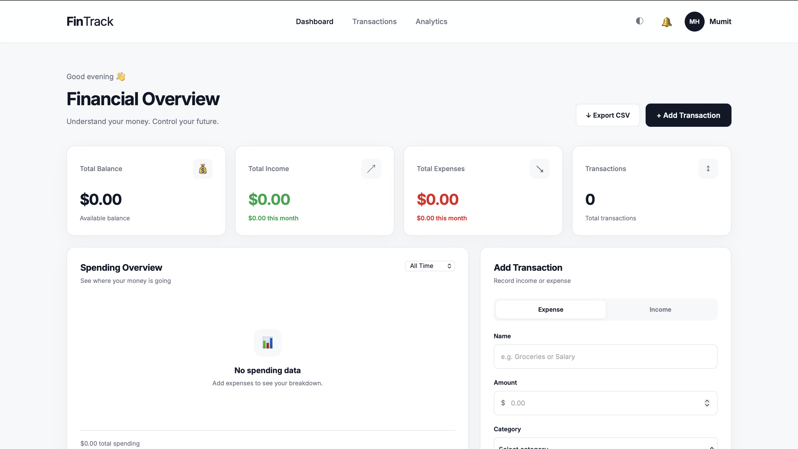
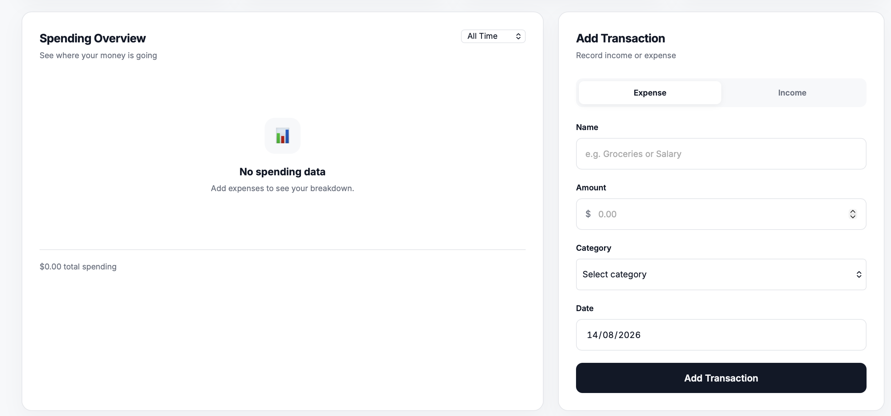
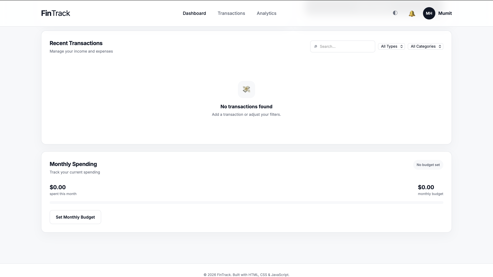

# 💰 FinTrack

### Modern Personal Finance Dashboard

**FinTrack** is a modern, responsive personal finance dashboard designed to help users track income, manage expenses, monitor budgets, and understand their spending patterns through a clean and intuitive interface.

Built with **HTML5, CSS3, and Vanilla JavaScript**, FinTrack provides a fully functional client-side finance management experience with persistent data storage using the browser's **LocalStorage API**.

<p align="center">

  <a href="https://md-mumit31.github.io/fintrack/">
    <strong>🚀 Live Demo</strong>
  </a>

  &nbsp;&nbsp;•&nbsp;&nbsp;

  <a href="https://github.com/md-mumit31/fintrack">
    <strong>📂 Source Code</strong>
  </a>

</p>

<p align="center">

  
  
  
  
  

</p>

---

## 🌐 Live Demo

### 🚀 [Open FinTrack](https://md-mumit31.github.io/fintrack/)

Try the fully functional application directly in your browser.

**No installation, account, or backend server is required.**

---

## 📸 Preview

### 🖥️ Dashboard



### 💳 Transaction Management



### 📱 Responsive & Dark Mode



---

## ✨ Features

### 💰 Financial Management

- Add income and expenses
- Edit existing transactions
- Delete transactions
- Automatically calculate total balance
- Track total income
- Track total expenses
- Track monthly income
- Track monthly expenses
- Track total transactions

### 🔎 Transaction Management

- Search transactions
- Filter by transaction type
- Filter by category
- Sort transactions by date
- View transaction details
- Categorize financial activity

### 🎯 Budget Management

- Set a monthly spending budget
- Track current monthly spending
- View budget progress
- Visual budget status
- Identify when spending approaches or exceeds the budget

### 📊 Spending Analytics

- View total spending
- Analyze spending by category
- Visualize category-based spending
- Compare spending proportions

### 🎨 User Experience

- Modern dashboard interface
- Responsive layout
- Dark mode
- Interactive forms
- Modal-based editing
- Toast notifications
- Clean financial data presentation

### 💾 Data Management

- Persistent transaction storage
- LocalStorage integration
- Data survives browser refreshes
- CSV transaction export

---

## 🛠️ Technologies

### Frontend

| Technology | Purpose |
|---|---|
| **HTML5** | Semantic page structure |
| **CSS3** | Styling, layout, animations & responsive design |
| **JavaScript ES6+** | Application logic and interactivity |

### Browser APIs

| API | Purpose |
|---|---|
| **LocalStorage API** | Persistent browser-based data storage |
| **DOM API** | Dynamic interface updates |
| **Blob API** | CSV file generation |

---

## 📊 Dashboard

FinTrack provides a centralized financial overview containing:

- **Total Balance**
- **Total Income**
- **Total Expenses**
- **Monthly Income**
- **Monthly Expenses**
- **Transaction Count**

The dashboard automatically updates whenever financial data changes.

---

## 💳 Transaction Management

FinTrack provides a complete client-side transaction management workflow.

Users can:

1. Add a transaction
2. Choose between income and expense
3. Select a category
4. Enter an amount
5. Select a date
6. Edit transactions
7. Delete transactions
8. Search transactions
9. Filter transactions

All changes are reflected immediately throughout the dashboard.

---

## 🎯 Monthly Budget

Users can create a monthly spending limit and monitor their progress through a visual budget indicator.

### 🟢 Within Budget

Spending remains comfortably below the monthly limit.

### 🟡 Approaching Limit

Spending is getting close to the monthly budget.

### 🔴 Budget Exceeded

Monthly spending has exceeded the defined limit.

This provides users with a quick overview of their current spending position.

---

## 📈 Spending Analytics

FinTrack automatically groups expenses by category.

The spending overview helps users understand where their money is going by displaying:

- Category
- Spending amount
- Percentage of total spending
- Visual spending indicators

This makes financial patterns easier to understand at a glance.

---

## 💾 Local Data Persistence

FinTrack uses the browser's **LocalStorage API** to persist transaction data.

This allows transactions to remain available after:

- Refreshing the page
- Closing the browser
- Reopening the application

The current version does not require a backend server or database.

> **Note:** Financial data is stored locally on the user's device and is not synchronized between devices.

---

## 📥 CSV Export

FinTrack allows users to export their transactions as a `.csv` file.

The exported data includes:

```text
Name
Amount
Category
Type
Date
```

This makes it possible to keep an external copy of financial records or analyze them using spreadsheet software.

---

## 🌙 Dark Mode

FinTrack includes a dark mode designed to provide a comfortable viewing experience in low-light environments.

The theme preference is stored locally so it can persist between sessions.

---

## 📱 Responsive Design

The interface is designed to work across different screen sizes:

- 🖥️ Desktop
- 💻 Laptop
- 📱 Mobile
- 📟 Tablet

The layout adapts to different screen sizes while maintaining a clean and usable experience.

---

## 🧠 What I Learned

Building FinTrack helped strengthen my understanding of modern frontend development, including:

- JavaScript DOM manipulation
- Event listeners
- Form handling
- Form validation
- Arrays and objects
- Array methods
- Filtering and sorting
- CRUD operations
- LocalStorage
- Dynamic UI rendering
- Modal interfaces
- Data visualization
- CSV generation
- Browser APIs
- Responsive design
- UI/UX implementation

---

## 🏗️ Project Structure

```text
fintrack/
│
├── assets/
│   └── screenshots/
│       ├── dashboard.png
│       ├── transaction.png
│       └── record.png
│
├── index.html
├── style.css
├── script.js
├── README.md
└── LICENSE
```

### `index.html`

Contains the structure of the FinTrack dashboard and application interface.

### `style.css`

Contains the visual styling, responsive layouts, dashboard components, modals, forms, animations, and UI states.

### `script.js`

Handles:

- Transaction management
- Dashboard calculations
- Searching
- Filtering
- Budget management
- Spending analytics
- LocalStorage
- CSV export
- Dark mode
- UI interactions

---

## 🚀 Getting Started

### 1. Clone the repository

```bash
git clone https://github.com/md-mumit31/fintrack.git
```

### 2. Navigate to the project

```bash
cd fintrack
```

### 3. Open the application

Open:

```text
index.html
```

in your browser.

No framework installation, package manager, or build process is required.

---

## 🔮 Future Improvements

Future versions of FinTrack may include:

- 👤 User authentication
- ☁️ Cloud data synchronization
- 🗄️ Backend database
- 📊 Advanced financial analytics
- 📅 Monthly and yearly reports
- 🎯 Savings goals
- 🔁 Recurring transactions
- 🔔 Budget notifications
- 📱 Enhanced mobile experience
- 🤖 AI-powered spending insights
- 📈 Advanced charts
- 🧾 Recurring bills
- 💱 Multiple currencies
- 🔐 Secure backend API

---

## 📌 Project Status

**Version:** 2.0  
**Status:** Completed ✅

FinTrack V2 is a fully functional client-side personal finance dashboard.

The project demonstrates:

- Modern frontend development
- JavaScript application logic
- Responsive UI design
- CRUD functionality
- Browser-based data persistence
- Financial dashboard design

---

## 👨‍💻 Author

### MD. Abdul Mumit Ibne Hossain

**Frontend Developer**

<p>
  <a href="https://github.com/md-mumit31">
    GitHub
  </a>
  &nbsp;•&nbsp;
  <a href="https://md-mumit31.github.io/fintrack/">
    FinTrack Live Demo
  </a>
</p>

---

## 📄 License

This project is licensed under the **MIT License**.

See the [`LICENSE`](./LICENSE) file for details.

---

<p align="center">

### 💰 FinTrack

**Understand your money. Control your future.**

Built with ❤️ using HTML, CSS & JavaScript.

</p>